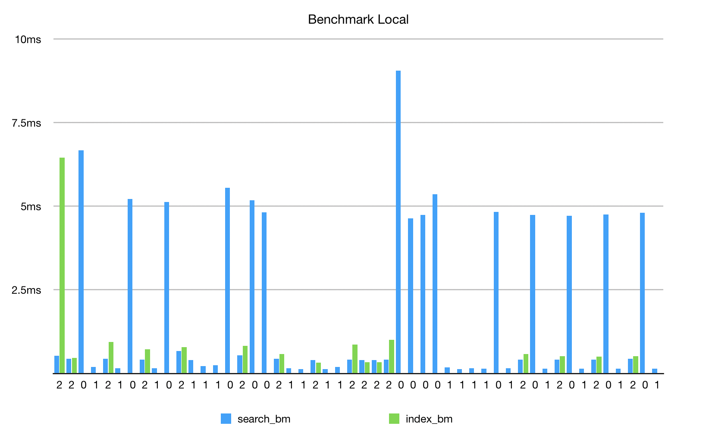
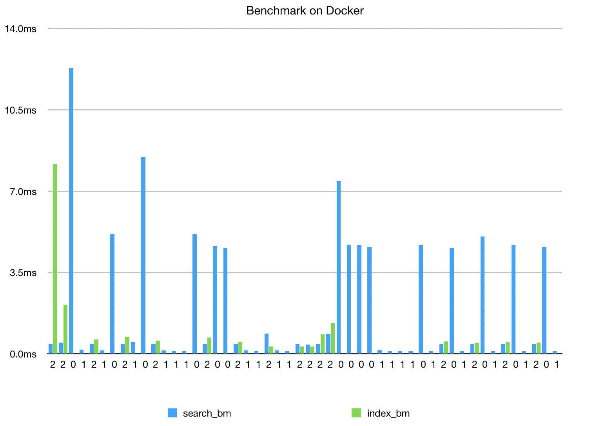

# Searchonastick

`searchonastick` searches text files via:

- string match
- regular expression
- indexed

and benchmarks the results. It looks for files in the `textfiles` directory
under the project directory. 

## Development and Project Structure

If you are not familiar with ruby gems and their structure, this will be 
helpful. The project structure is as follows:

```
.gitignore             # keeps cruft out of my git repo
.ruby-version          # version of ruby (honored by ruby version managers)
Dockerfile             # file to enable running in docker
Gemfile                # file to list dependent libraries
Gemfile.lock           # generated file with specific library versions
LICENSE.txt            # MIT license
README.md              # this file (how meta)
Rakefile               # like a Makefile, but ruby
benchmark              # empty directory for benchmark to write CSV file
bin                    # contains top level scripts
img                    # images in case README.md needs illustrations
index_files            # empty directory to keep index files if you use -k
lib                    # FIND BUSINESS LOGIC HERE
searchonastick.gemspec # file to define this gem (library)
spec                   # TESTS LIVE HERE
textfiles              # this is where you'll put files to be searched

```


## Installation

### Docker

Hopefully, you have docker installed.

Sure, this is a ruby gem, but if ruby is not your primary stack (and you're not
used to dealing with installing and managing ruby dependencies) don't worry. 
We have a docker command for you. All commands in these instructions assume
you're running them from the top of the project directory.

    $ docker build -t searchonastick .

Test your install:

    $ docker run --rm -v "$PWD":/usr/searchonastick -w /usr/searchonastick ruby:2.5 bundle install && rake

You should see output similar to the following:

    Finished in 0.01867 seconds (files took 0.19642 seconds to load)
    26 examples, 0 failures

This runs the `rspec` tests for the codebase.

### Local

Add this line to your application's Gemfile:

```
ruby gem 'searchonastick'
```

And then execute:

    $ bundle

Or install it yourself as:

    $ gem install searchonastick

## Usage

Docker and local commands are slightly different. (The docker ones are longer!)

### Docker

To run the script for this case study, run the following to see the usage text:

    $ docker run --rm -v "$PWD":/usr/searchonastick -w /usr/searchonastick ruby:2.5 bundle install && bin/searchit

This will search text files in the `textfiles` directory. Copy your textfiles
into this directory (don't worry everything in there is `.gitignore`ed). This
was built using:

- french_armed_forces.txt
- hitchhikers.txt
- warp_drive.txt

To run a *String* search or a *Regex* search, pass the `-m` flag follwed with a
`1` or `2`. Be sure to include `-s` followed with a word for which you want to 
search. *Remember to copy search files into your local textfiles directory.*

To run an *Index* search, you can save off an index of your documents for an
increase in performance on subsequent searches, e.g.,

    $ docker run --rm -v "$PWD":/usr/searchonastick -w /usr/searchonastick ruby:2.5 bundle install && bin/searchit -m 3 -k -s platypus 

Will produce output similar to:

```
Search Results:

        textfiles/warp_drive.txt - 0 matches

        textfiles/french_armed_forces.txt - 0 matches

        textfiles/hitchhikers.txt - 0 matches

Timing:

        Time to index - 4.608000000000011ms
        Time to search - 0.41599999999999626ms

```

The `-k` flag marshals the index into a flat file and saves it for the next run,
which will greatly reduce the time to index output, when you replace the `-k` flag
with an `-r` flag:

    $ docker run --rm -v "$PWD":/usr/searchonastick -w /usr/searchonastick ruby:2.5 bundle install && bin/searchit -m 3 -r -s to

This will generate slightly different search and index numbers (also because I
searched for a different word):

```
Search Results:

        textfiles/french_armed_forces.txt - 9 matches

        textfiles/hitchhikers.txt - 9 matches

        textfiles/warp_drive.txt - 3 matches

Timing:

        Time to index - 0.6570000000000014ms
        Time to search - 0.42400000000000426ms

```

#### Benchmark

If you want to see how this code runs for many different search words running
against all three search strategies, you can use the `rake benchmark[x]` command
where `x` is the number of times you want to run the benchmark. The benchmark is
an arrangement of 50 somewhat randomized searches each using a random search
word from an array of 13 words, some of which will be found in the spec text
files and some of which will not be found. 

**NOTE:** the benchmark looks for text files to search in the `textfiles`
directory.

```
$ docker run --rm -v "$PWD":/usr/searchonastick -w /usr/searchonastick ruby:2.5 bundle install && rake benchmark[5]
```

This command generates output similar to the following:

```
Fetching gem metadata from https://rubygems.org/..........
... # omitted for readability
Using searchonastick 0.1.0 from source at `.`
Bundle complete! 5 Gemfile dependencies, 9 gems now installed.
Bundled gems are installed into `/usr/local/bundle`
benchmarking... looping 5 times

```

Not much output, but you can read the benchmark results in
`benchmark/search_compare.csv`. The logic for the benchmark is in the `Rakefile` 
in a task named `benchmark`. Here are some sample charts generated from
benchmark runs.

The green bars represent index file load times, the first one per benchmark 
was is on the far left in both charts and this takes the longest because it has
to generate the index. There are no green bars for the scan and regex
strategies. 





### Local 

Coming soon

## License

The gem is available as open source under the terms of the [MIT License](https://opensource.org/licenses/MIT).
